# HealthAI Coach — Modèle de données (MCD / MLD / MPD)

**Statut** : proposition initiale à valider par le Rôle A avant implémentation définitive (Sprint 1). Section `ORGANIZATIONS`/`SUBSCRIPTIONS` ajoutée ultérieurement pour le modèle économique (freemium/premium/premium+/B2B) — statut également proposition initiale.
**Périmètre couvert** : utilisateurs, nutrition, exercices, biométrie, profil médical, préférences alimentaires, profil de forme, recommandations diététiques, journal de qualité des données, abonnements (cf. Sprints 1, 2, 3, 4).

---

## 1. MCD (Modèle Conceptuel de Données)

**Lecture des cardinalités** : chaque libellé porte les deux paires (min,max) au format `(entité gauche) verbe (entité droite)` — ex. `(0,n) enregistre (1,1)` se lit "un USER enregistre 0 à N NUTRITION_LOGS ; un NUTRITION_LOGS appartient à exactement 1 USER". Les symboles pieds-de-corbeau (`||`, `o{`, `|o`) restent en plus pour le rendu graphique, mais c'est la paire écrite qui fait foi.

```mermaid
erDiagram
    USERS ||--o{ NUTRITION_LOGS : "(0,n) enregistre (1,1)"
    FOOD_ITEMS ||--o{ NUTRITION_LOGS : "(0,n) est consommé dans (1,1)"
    USERS ||--o{ WORKOUT_SESSIONS : "(0,n) réalise (1,1)"
    WORKOUT_SESSIONS ||--o{ WORKOUT_SETS : "(0,n) contient (1,1)"
    EXERCISES ||--o{ WORKOUT_SETS : "(0,n) est utilisé dans (1,1)"
    USERS ||--o{ BIOMETRIC_MEASUREMENTS : "(0,n) mesure (1,1)"
    USERS ||--o{ MEDICAL_PROFILES : "(0,n) a un historique (1,1)"
    USERS ||--o{ DIETARY_PREFERENCES : "(0,n) déclare (1,1)"
    USERS ||--o{ FITNESS_PROFILES : "(0,n) s'auto-évalue (1,1)"
    USERS ||--o{ DIET_RECOMMENDATIONS : "(0,n) reçoit (1,1)"
    USERS |o--o{ DATA_QUALITY_LOG : "(0,n) résout (0,1)"
    USERS ||--o{ SUBSCRIPTIONS : "(0,n) souscrit (1,1)"
    ORGANIZATIONS |o--o{ SUBSCRIPTIONS : "(0,n) facture (0,1)"

    USERS {
        int user_id PK
        string email
        string hashed_password
        string first_name
        string last_name
        date date_of_birth
        string sex
        bool is_admin
    }
    FOOD_ITEMS {
        int food_item_id PK
        string external_id
        string source
        string name
        string brand
        numeric calories_kcal
    }
    NUTRITION_LOGS {
        bigint log_id PK
        numeric quantity_g
        string meal_type
        timestamp logged_at
    }
    EXERCISES {
        int exercise_id PK
        string external_id
        string name
        string body_part
        string target_muscle
        string equipment
    }
    WORKOUT_SESSIONS {
        bigint session_id PK
        timestamp started_at
        timestamp ended_at
        smallint max_bpm
        smallint avg_bpm
        string notes
    }
    WORKOUT_SETS {
        bigint set_id PK
        smallint set_number
        smallint reps
        numeric weight_kg
        int duration_seconds
    }
    BIOMETRIC_MEASUREMENTS {
        bigint measurement_id PK
        timestamp measured_at
        numeric weight_kg
        numeric height_cm
        numeric body_fat_pct
    }
    MEDICAL_PROFILES {
        bigint medical_profile_id PK
        string disease_type
        string severity
        numeric cholesterol_mg_dl
        numeric blood_pressure_mmhg
        numeric glucose_mg_dl
        timestamp recorded_at
    }
    DIETARY_PREFERENCES {
        bigint dietary_preference_id PK
        string dietary_restrictions
        string allergies
        string preferred_cuisine
        timestamp recorded_at
    }
    FITNESS_PROFILES {
        bigint fitness_profile_id PK
        string physical_activity_level
        smallint workout_frequency_days_per_week
        string experience_level
        numeric weekly_exercise_hours
        timestamp recorded_at
    }
    DIET_RECOMMENDATIONS {
        bigint diet_recommendation_id PK
        numeric daily_caloric_intake_kcal
        numeric adherence_to_diet_plan_pct
        numeric dietary_nutrient_imbalance_score
        string recommendation
        timestamp recommended_at
    }
    DATA_QUALITY_LOG {
        bigint dq_log_id PK
        string source_table
        string rule_name
        string severity
        bool resolved
    }
    ORGANIZATIONS {
        int organization_id PK
        string name
        string contact_email
    }
    SUBSCRIPTIONS {
        bigint subscription_id PK
        string tier
        string status
        int price_eur_cents
        timestamp started_at
        timestamp ended_at
    }
```



### Note de conception : pourquoi `WORKOUT_SETS` ?

`WORKOUT_SESSIONS` et `EXERCISES` sont conceptuellement en relation N,N : une séance comporte plusieurs exercices, un exercice apparaît dans plusieurs séances. Suivant la règle Merise de résolution des associations N,N, cette association devient sa propre table dans le MLD — c'est `WORKOUT_SETS`. Ce n'est pas une simple table de jonction technique : elle porte ses propres attributs (`set_number`, `reps`, `weight_kg`, `duration_seconds`, `distance_m`) qui ne peuvent appartenir ni à `WORKOUT_SESSIONS` seule (une séance a des reps/poids différents par exercice) ni à `EXERCISES` seule (le même exercice a des reps/poids différents selon la séance) — ce sont des attributs de l'association elle-même. Elle va même plus loin qu'une simple résolution N,N : la granularité réelle n'est pas "séance × exercice" mais "séance × exercice × numéro de série", pour tracer chaque série individuellement (progression des charges dans le temps).

### Note de conception : modèle économique (`ORGANIZATIONS` / `SUBSCRIPTIONS`)

Le modèle économique de HealthAI Coach est hybride : `free`, `premium` (9,99 €/mois),
`premium+` (19,99 €/mois) pour les particuliers, et `b2b` pour la distribution en marque
blanche (salles de sport, mutuelles, entreprises). `SUBSCRIPTIONS` suit le même pattern
d'historisation que `MEDICAL_PROFILES`/`FITNESS_PROFILES` (1 utilisateur -> N souscriptions
dans le temps) plutôt qu'un simple champ `tier` sur `USERS`, pour garder la trace des
changements de palier (upgrade/downgrade/résiliation).

`ORGANIZATIONS` est une entité séparée (et non un simple attribut sur `USERS`) car le lien
"quel utilisateur est rattaché à quelle salle/mutuelle/entreprise" est porté par la
souscription elle-même (`SUBSCRIPTIONS.organization_id`), pas par l'utilisateur en permanence :
un utilisateur peut changer d'organisation (ex. changement d'employeur) sans perdre l'historique
de ses souscriptions précédentes. La cardinalité `(0,1)` côté `ORGANIZATIONS` reflète que
`organization_id` n'est renseigné que pour les souscriptions `tier = 'b2b'`.

### Points à valider avec le Rôle A

- Pas d'entité "coach" distincte des `USERS` (un simple flag `is_admin`) — à confirmer si un rôle coach séparé est nécessaire.
- `DATA_QUALITY_LOG` n'a volontairement pas de FK stricte vers les tables sources : elle référence `source_table` / `source_record_id` en texte libre car elle doit pouvoir logger des anomalies sur n'importe quelle table ingérée (nutrition, exercises, biometrics) sans contrainte de schéma — cf. Sprint 3.
- Une mesure biométrique par utilisateur est supposée unique par timestamp (`UNIQUE (user_id, measured_at)`) — à confirmer si plusieurs mesures le même jour (matin/soir) doivent être autorisées.
- Pas d'entité "objectifs" (goals) ni de plan nutritionnel/sportif prescrit — absent des sprints fournis, à ajouter si besoin métier confirmé.
- `MEDICAL_PROFILES`, `DIETARY_PREFERENCES`, `FITNESS_PROFILES`, `DIET_RECOMMENDATIONS` sont historisées (1 utilisateur -> N relevés dans le temps, comme `BIOMETRIC_MEASUREMENTS`) plutôt que 1-1, pour garder l'historique des changements — à confirmer que c'est le bon choix plutôt qu'un profil unique mis à jour en place.
- `blood_pressure_mmhg` est stocké comme une valeur unique (le dataset source ne distingue pas systolique/diastolique) — à revoir si une vraie mesure tensionnelle (deux valeurs) est nécessaire.
- `SUBSCRIPTIONS.price_eur_cents` trace le prix convenu au moment de la souscription mais n'est ni facturé ni prélevé par l'API (pas d'intégration de paiement dans ce lot) — à confirmer qu'un prestataire externe (Stripe ou équivalent) fera foi pour la facturation réelle et que cette colonne restera informative.
- Une seule souscription `active` par utilisateur à la fois est imposée (index unique partiel `WHERE status = 'active'`) — à confirmer qu'un changement de palier doit bien clore l'ancienne souscription plutôt que d'autoriser des souscriptions actives concurrentes.
- `ORGANIZATIONS` est volontairement minimal (nom + email de contact) : pas de gestion de marque blanche (logo, sous-domaine, plan négocié par organisation) dans ce lot — à enrichir si le besoin B2B se précise.
- Le statut `expired` n'est pas positionné automatiquement par l'API à l'échéance d'une souscription (pas de tâche planifiée dans ce lot) — à confirmer si un job périodique (Airflow ?) doit faire cette transition.

---

## 2. MLD (Modèle Logique de Données)

Notation Merise : `#` préfixe une clé étrangère.

```
USERS (user_id, email, hashed_password, first_name, last_name, date_of_birth, sex, is_admin, created_at, updated_at)

FOOD_ITEMS (food_item_id, external_id, source, name, brand, calories_kcal, protein_g, carbs_g, fat_g, fiber_g, sugar_g, sodium_mg, cholesterol_mg, serving_size_g, ingested_at)

NUTRITION_LOGS (log_id, #user_id, #food_item_id, quantity_g, meal_type, logged_at, created_at)

EXERCISES (exercise_id, external_id, source, name, body_part, target_muscle, equipment, gif_url, instructions, ingested_at)

WORKOUT_SESSIONS (session_id, #user_id, started_at, ended_at, max_bpm, avg_bpm, notes, created_at)

WORKOUT_SETS (set_id, #session_id, #exercise_id, set_number, reps, weight_kg, duration_seconds, distance_m)

BIOMETRIC_MEASUREMENTS (measurement_id, #user_id, measured_at, weight_kg, height_cm, body_fat_pct, muscle_mass_kg, resting_heart_rate, source, created_at)

MEDICAL_PROFILES (medical_profile_id, #user_id, disease_type, severity, cholesterol_mg_dl, blood_pressure_mmhg, glucose_mg_dl, recorded_at)

DIETARY_PREFERENCES (dietary_preference_id, #user_id, dietary_restrictions, allergies, preferred_cuisine, recorded_at)

FITNESS_PROFILES (fitness_profile_id, #user_id, physical_activity_level, workout_frequency_days_per_week, experience_level, weekly_exercise_hours, recorded_at)

DIET_RECOMMENDATIONS (diet_recommendation_id, #user_id, daily_caloric_intake_kcal, adherence_to_diet_plan_pct, dietary_nutrient_imbalance_score, recommendation, recommended_at)

DATA_QUALITY_LOG (dq_log_id, source_table, source_record_id, dag_id, rule_name, severity, message, detected_at, resolved, resolved_at, #resolved_by)

ORGANIZATIONS (organization_id, name, contact_email, created_at)

SUBSCRIPTIONS (subscription_id, #user_id, #organization_id, tier, status, price_eur_cents, started_at, ended_at, created_at)
```

Toutes les associations du MCD sont de cardinalité (1,N) côté "possède/contient" — c'est-à-dire FK `NOT NULL` (participation obligatoire) — **sauf `DATA_QUALITY_LOG.resolved_by` et `SUBSCRIPTIONS.organization_id`, en (0,N)** : une anomalie peut rester non résolue et une souscription peut ne pas être liée à une organisation (FK nullable), donc la cardinalité côté `USERS`/`ORGANIZATIONS` est `(0,1)` et non `(1,1)` comme pour toutes les autres relations. Aucune table associative n'est nécessaire par ailleurs, chaque FK est absorbée côté table "N".

---

## 3. MPD (Modèle Physique de Données)

Traduit en PostgreSQL dans [`ddl_postgres.sql`](./ddl_postgres.sql) : types précis, contraintes `CHECK`, `NOT NULL`, `UNIQUE`, `ON DELETE`, et index sur les colonnes de filtrage/tri fréquents (`user_id` + colonne temporelle sur chaque table de journal).

`DATA_QUALITY_LOG` porte en plus un `CHECK` de cohérence (`chk_data_quality_log_resolution_consistency`) : `resolved_at`/`resolved_by` ne peuvent être renseignés que si `resolved = TRUE` — ce n'est pas une règle de forme normale (3NF ne regarde que les dépendances fonctionnelles), mais une règle métier qui aurait pu être violée silencieusement sans cette contrainte.

`SUBSCRIPTIONS` porte le même type de `CHECK` de cohérence métier (`chk_subscriptions_b2b_organization`) : `organization_id` doit être renseigné si et seulement si `tier = 'b2b'`. Un index unique partiel (`uq_subscriptions_one_active_per_user`) garantit par ailleurs qu'un utilisateur n'a jamais plus d'une souscription `status = 'active'` simultanément.

**Le diagramme généré par drawdb (*Import → SQL* à partir de `ddl_postgres.sql`) est une vue du MPD**, pas du MCD : il affiche les types SQL concrets (`SERIAL`, `VARCHAR(255)`, `NUMERIC(7,2)`...) et les contraintes physiques, avec une notation simplifiée `1`/`n` qui code uniquement le maximum — jamais l'optionalité (0 vs 1). Pour vérifier une cardinalité Merise complète (min,max), se référer au MCD ci-dessus ou à la nullabilité des colonnes FK dans le DDL.

## Import dans drawdb

Le fichier `ddl_postgres.sql` peut être importé directement dans [drawdb](https://drawdb.app) via *Import → SQL* pour obtenir le diagramme visuel (MPD).
