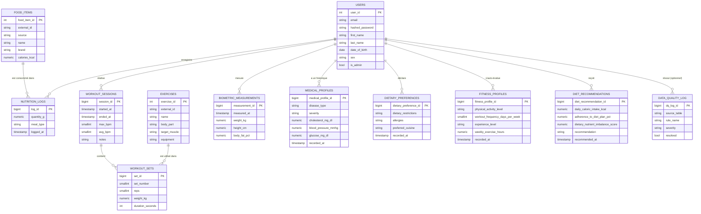

# HealthAI Coach — Modèle de données (MCD / MLD / MPD)

**Statut** : proposition initiale à valider par le Rôle A avant implémentation définitive (Sprint 1).
**Périmètre couvert** : utilisateurs, nutrition, exercices, biométrie, profil médical, préférences alimentaires, profil de forme, recommandations diététiques, journal de qualité des données (cf. Sprints 1, 2, 3, 4).

---

## 1. MCD (Modèle Conceptuel de Données)



### Points à valider avec le Rôle A

- Pas d'entité "coach" distincte des `USERS` (un simple flag `is_admin`) — à confirmer si un rôle coach séparé est nécessaire.
- `DATA_QUALITY_LOG` n'a volontairement pas de FK stricte vers les tables sources : elle référence `source_table` / `source_record_id` en texte libre car elle doit pouvoir logger des anomalies sur n'importe quelle table ingérée (nutrition, exercises, biometrics) sans contrainte de schéma — cf. Sprint 3.
- Une mesure biométrique par utilisateur est supposée unique par timestamp (`UNIQUE (user_id, measured_at)`) — à confirmer si plusieurs mesures le même jour (matin/soir) doivent être autorisées.
- Pas d'entité "objectifs" (goals) ni de plan nutritionnel/sportif prescrit — absent des sprints fournis, à ajouter si besoin métier confirmé.
- `MEDICAL_PROFILES`, `DIETARY_PREFERENCES`, `FITNESS_PROFILES`, `DIET_RECOMMENDATIONS` sont historisées (1 utilisateur -> N relevés dans le temps, comme `BIOMETRIC_MEASUREMENTS`) plutôt que 1-1, pour garder l'historique des changements — à confirmer que c'est le bon choix plutôt qu'un profil unique mis à jour en place.
- `blood_pressure_mmhg` est stocké comme une valeur unique (le dataset source ne distingue pas systolique/diastolique) — à revoir si une vraie mesure tensionnelle (deux valeurs) est nécessaire.

---

## 2. MLD (Modèle Logique de Données)

Notation Merise : `#` préfixe une clé étrangère.

```
USERS (user_id, email, hashed_password, first_name, last_name, date_of_birth, sex, is_admin, created_at, updated_at)

FOOD_ITEMS (food_item_id, external_id, source, name, brand, calories_kcal, protein_g, carbs_g, fat_g, fiber_g, sugar_g, sodium_mg, cholesterol_mg, serving_size_g, ingested_at)

NUTRITION_LOGS (log_id, #user_id, #food_item_id, quantity_g, meal_type, logged_at, created_at)

EXERCISES (exercise_id, external_id, source, name, body_part, target_muscle, equipment, gif_url, instructions, ingested_at)

WORKOUT_SESSIONS (session_id, #user_id, started_at, ended_at, max_bpm, avg_bpm, notes, created_at)

WORKOUT_SETS (set_id, #session_id, #exercise_id, set_number, reps, weight_kg, duration_seconds, distance_m)

BIOMETRIC_MEASUREMENTS (measurement_id, #user_id, measured_at, weight_kg, height_cm, body_fat_pct, muscle_mass_kg, resting_heart_rate, source, created_at)

MEDICAL_PROFILES (medical_profile_id, #user_id, disease_type, severity, cholesterol_mg_dl, blood_pressure_mmhg, glucose_mg_dl, recorded_at)

DIETARY_PREFERENCES (dietary_preference_id, #user_id, dietary_restrictions, allergies, preferred_cuisine, recorded_at)

FITNESS_PROFILES (fitness_profile_id, #user_id, physical_activity_level, workout_frequency_days_per_week, experience_level, weekly_exercise_hours, recorded_at)

DIET_RECOMMENDATIONS (diet_recommendation_id, #user_id, daily_caloric_intake_kcal, adherence_to_diet_plan_pct, dietary_nutrient_imbalance_score, recommendation, recommended_at)

DATA_QUALITY_LOG (dq_log_id, source_table, source_record_id, dag_id, rule_name, severity, message, detected_at, resolved, resolved_at, #resolved_by)
```

Toutes les associations du MCD sont de cardinalité 1,N côté "possède/contient" — aucune table associative n'est nécessaire, chaque FK est absorbée côté table "N".

---

## 3. MPD (Modèle Physique de Données)

Traduit en PostgreSQL dans [`ddl_postgres.sql`](./ddl_postgres.sql) : types précis, contraintes `CHECK`, `NOT NULL`, `UNIQUE`, `ON DELETE`, et index sur les colonnes de filtrage/tri fréquents (`user_id` + colonne temporelle sur chaque table de journal).

## Import dans drawdb

Le fichier `ddl_postgres.sql` peut être importé directement dans [drawdb](https://drawdb.app) via *Import → SQL* pour obtenir le diagramme visuel.
