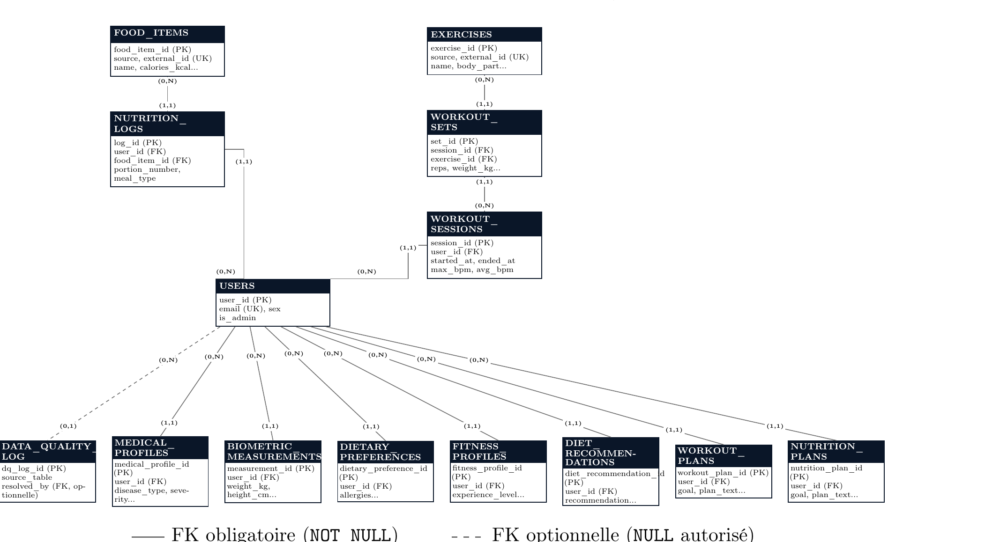
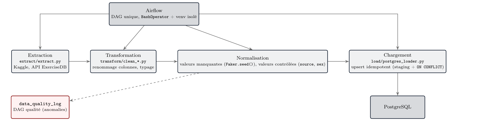
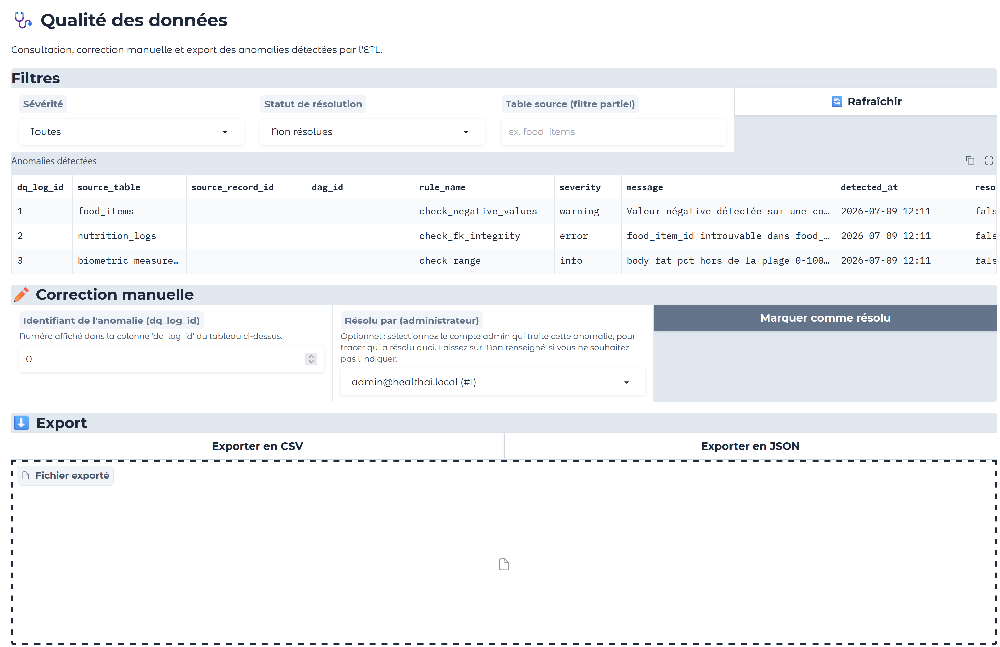
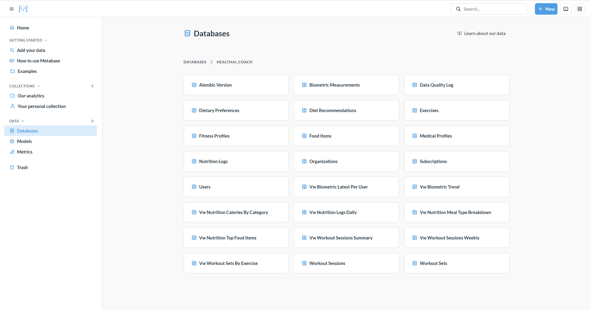

# HealthAI Coach
## Backend Data Engineering

Nutrition, activité physique, qualité des données — de l'ingestion à l'orchestration

<br>

Alexandre Laugier · Florian Abgrall · Johane Decamps · William Mibelli

Juillet 2026

<!--
- Bonjour, je présente le backend data de HealthAI Coach, une plateforme de coaching santé
- Équipe de 4 : répartition en 3 rôles (architecture/data, API, ETL)
- Plan : contexte -> architecture -> ce qui a été construit -> démo live -> bilan
- Durée cible ~50 min avec la démo
-->

---

# Sommaire

1. Contexte & objectifs
2. Architecture du système
3. Modélisation des données
4. Pipeline ETL & orchestration Airflow
5. API REST
6. Interface admin & qualité des données
7. Dockerisation
8. Tests & CI/CD
9. Démonstration live
10. Bilan & conclusion

<!--
- Progression : POURQUOI (contexte) -> COMMENT (architecture, modèle, pipeline, API) -> PREUVE (démo live) -> BILAN
- La démo live est le moment fort : on y verra les données réelles remplacer les données de démo en direct
-->

---
layout: section
---

# 01 · Contexte & objectifs

<!--
- Poser le décor avant de rentrer dans le technique : qui, pourquoi, pour qui
-->

---

# HealthAI Coach, c'est quoi ?

- Plateforme de **coaching santé** : suivi nutritionnel, activité physique, relevés biométriques, profil médical déclaratif
- Génération de recommandations personnalisées (diététiques aujourd'hui, plans d'entraînement/nutrition via microservice IA à venir)
- Ce dépôt = le **backend data** uniquement : base de données, pipeline ETL, API REST, supervision qualité, conteneurisation
- Pas de frontend utilisateur final — hors périmètre de cette formation

<!--
- Insister sur le périmètre : c'est un projet backend/data, pas une appli complète
- Les captures qu'on montrera sont des outils internes (admin, Metabase), pas l'app finale
-->

---

# Modèle économique

Deux offres, qui conditionnent des choix techniques concrets :

- **Freemium** — `free` / `premium` / `premium_plus`
  → fonctionnalités IA réservées aux paliers payants (gating côté API)
- **B2B en marque blanche** — organisations partenaires (salles de sport, mutuelles, entreprises)
  → provisionné par un admin, pas de self-service pour ce palier

<!--
- Le modèle économique n'est pas cosmétique : il a façonné le schéma (table subscriptions),
  les dépendances FastAPI (CurrentPremiumUser), et les règles d'accès
-->

---

# Répartition des rôles

| Rôle | Périmètre | Qui |
|---|---|---|
| **A** | Architecture, base de données, interface admin, Metabase, dockerisation | Alexandre |
| **B** | API REST (FastAPI) | Florian Abgrall |
| **C** | Pipeline ETL, orchestration Airflow | Johane, William |

Flux de travail : une étape = une Pull Request, tests obligatoires, revue avant fusion

<!--
- Workflow Git strict dès le départ : ça a payé, plusieurs bugs réels attrapés en revue avant fusion
- Le rôle A a repris une partie de l'orchestration Airflow en fin de projet, faute de temps côté équipe ETL
-->

---
layout: section
---

# 02 · Architecture du système

<!--
- Transition : maintenant qu'on sait pourquoi, comment le système est structuré globalement
-->

---

# Vue d'ensemble

```
Sources externes (Kaggle, API ExerciseDB)
        │
        ▼
   ETL (extract/transform/load) ◄── Airflow (orchestration)
        │
        ▼
     PostgreSQL (16 tables)
      │        │        │
      ▼        ▼        ▼
  API REST  Interface  Metabase
  (FastAPI)  admin      (dashboard KPI)
             (Gradio)
```

Tout conteneurisé via `docker compose` (sept services), une seule commande

<!--
- L'ETL alimente Postgres, orchestré par Airflow
- Trois consommateurs en aval : API pour les utilisateurs finaux, interface admin pour la qualité, Metabase pour le pilotage
- On reverra ce schéma en vrai pendant la démo
-->

---

# Choix technologiques

<div class="text-sm">

| Composant | Techno | Pourquoi |
|---|---|---|
| Base de données | PostgreSQL | Domaine relationnel — contraintes CHECK/FK portent les règles métier |
| Migrations | Alembic | Schéma versionné et rejouable (upgrade/downgrade), historique traçable en équipe |
| Orchestration | Apache Airflow | |
| API | FastAPI | SQLAlchemy, Pydantic, JWT |
| Dashboard | Metabase | |
| Interface admin | Gradio | Outil interne à faible surface, rapidité prime sur personnalisation |
| Conteneurisation | Docker Compose | |

</div>

<!--
- PostgreSQL plutôt que NoSQL : les contraintes d'intégrité (CHECK, FK) auraient dû être
  réimplémentées côté application dans un magasin sans schéma — pas un choix par défaut, un choix motivé
- Alembic : outil de migration de schéma pour SQLAlchemy — chaque évolution (ex. ajout
  organizations/subscriptions, puis workout_plans/nutrition_plans) devient un script Python
  versionné et rejouable, avec l'historique suivi en base via la table alembic_version
  (plutôt que des ALTER TABLE manuels non tracés)
- Gradio : compromis assumé, au prix de limitations d'accessibilité qu'on détaillera
-->

---
layout: section
---

# 03 · Modélisation des données

<!--
- Cœur du projet : tout le reste (ETL, API, admin) s'organise autour de ce schéma
-->

---

# Le schéma en un coup d'œil

- **16 tables**, 5 domaines fonctionnels autour de `USERS` :
  nutrition · activité physique · suivi de santé déclaratif · abonnements · contenu généré par IA
- Schéma **auto-documenté** : `COMMENT ON TABLE/COLUMN` directement en base
  → les conventions non triviales survivent, pas seulement dans un doc externe qui peut diverger

<!--
- Le choix d'auto-documenter en SQL est un point fort qu'on assumera dans le bilan
-->

---

# Modèle Conceptuel de Données



<!--
- Cardinalités au format Merise (min,max)
- USERS au centre, rattaché à 8 domaines : nutrition, activité, biométrie, médical, alimentaire,
  forme, recommandations, plans IA
- Trait plein = FK obligatoire, pointillé = FK optionnelle (ex. resolved_by, nullable)
-->

---

# Conventions d'intégrité

- **Idempotence au chargement** : `UNIQUE(source, external_id)` sur `food_items`/`exercises`
  → upsert (`ON CONFLICT DO UPDATE`), les DAG Airflow peuvent être rejoués sans dupliquer
- **Génération de données manquantes** : `Faker.seed()` déterministe par ligne source
  → un même utilisateur ne change pas de nom à chaque ré-exécution du pipeline

Un bug réel, capturé par la contrainte plutôt que par les tests :

```sql
sex VARCHAR(10) CHECK (sex IN ('F', 'M', 'other'))
```

```python
# ETL : 'Other' (majuscule) ≠ 'other' → rejeté par PostgreSQL,
# mais les 4 tests unitaires du module (entrées mockées) passaient
users["sex"] = users["sex"].replace({"None": "Other"})
```

<!--
- La contrainte CHECK a fait exactement son travail : bloquer une donnée invalide en base
- Les tests unitaires mockaient l'entrée, donc ne touchaient jamais la vraie contrainte —
  c'est ce qui a motivé la discipline "toujours retester contre un vrai Postgres" pour la suite
-->

---

# Conventions d'intégrité (suite)

- **Cohérence métier en base**, pas dans le code applicatif :

```sql
CONSTRAINT chk_subscriptions_b2b_organization
  CHECK ((tier = 'b2b' AND organization_id IS NOT NULL)
      OR (tier <> 'b2b' AND organization_id IS NULL))
```

- Garantit qu'une organisation n'est renseignée que pour les abonnements B2B, et inversement —
  impossible à contourner en écrivant directement en base, contrairement à une validation
  uniquement côté API

<!--
- Point à raconter : un bug réel où l'ETL produisait 'Other' (majuscule) au lieu de 'other',
  rejeté par PostgreSQL mais indétecté par les tests unitaires mockés — on y revient dans le bilan
-->

---
layout: section
---

# 04 · Pipeline ETL & orchestration Airflow

<!--
- Section la plus riche en obstacles réels rencontrés — bien la préparer
-->

---

# Structure du pipeline



<!--
- extract : télécharge les 4 datasets Kaggle + pagine l'API ExerciseDB
- transform : renommage colonnes, typage, remplissage déterministe
- load : upsert idempotent (staging + ON CONFLICT pour food_items/exercises,
  INSERT...ON CONFLICT...RETURNING pour users)
- quality_check : règles réelles, journalise dans data_quality_log
-->

---

# Extraction multi-sources (E)

- **ExerciseDB API** : pagination par curseur (`nextCursor`) pour récupérer l'intégralité du catalogue
- **Kaggle** : 4 datasets téléchargés automatiquement (Nutrition, Diet, User, Activity)
- **Rate limiting** : décorateurs `@limits` / `@sleep_and_retry` pour respecter les quotas d'API et éviter les blocages
- Stockage brut (CSV/JSON) avant toute transformation — étape rejouable indépendamment du reste du pipeline

<!--
- Travail de Johane et William — la pagination par curseur sur ExerciseDB n'était pas
  documentée clairement côté API, découverte par tâtonnement
- Le stockage brut intermédiaire sert de filet de sécurité : en cas d'échec transform/load,
  pas besoin de retéléchargner
-->

---

# Nettoyage & anonymisation (T)

- **Anonymisation** : `Faker` avec `seed=42` déterministe — faux noms/emails cohérents, mais reproductibles d'un run à l'autre (tests, debug)
- **Normalisation** : `'Male'/'Female'` → `'M'/'F'`, valeurs manquantes → `'other'`
- **Dérivation de champs** : date de naissance calculée depuis l'âge fourni, `ended_at` des sessions calculé depuis la durée

<!--
- Le seed=42 déterministe est ce qui a permis de repérer le bug 'Other' vs 'other'
  (diapo précédente sur les contraintes CHECK) — un run non déterministe l'aurait masqué
  de façon aléatoire selon les données tirées
- Dérivation de ended_at : nécessaire car la source ne fournit que la durée, pas l'horodatage de fin
-->

---

# Chargement PostgreSQL (L)

- **Tables de staging** : injection rapide via `to_sql` dans des tables temporaires, avant bascule vers les tables finales
- **Stratégie UPSERT** : `ON CONFLICT ... DO UPDATE` pour les catalogues (`food_items`, `exercises`) — idempotent, pas de doublons en cas de relance
- **Historisation différenciée** : séries temporelles biométriques ajoutées en continu, dimensions (profils utilisateurs) synchronisées

<!--
- Le passage par une table de staging évite de verrouiller la table finale pendant tout
  le chargement — important une fois qu'Airflow orchestre ça en tâche de fond quotidienne
- Historisation différenciée : biométrie = append-only (on veut la série complète),
  profils = upsert (on ne garde que l'état courant)
-->

---

# Orchestration Airflow

- **Un DAG unique** plutôt qu'un DAG par source : le volume ne justifie pas plus de granularité
- `extract` → `transform_and_load` → `quality_check`, séquentiel, `@daily`
- **Problème réel** : Airflow exige `SQLAlchemy<2.0` en interne, incompatible avec le `2.0.51`
  utilisé partout ailleurs → **venv Python isolé** (`/opt/etl-venv`), tâches en `BashOperator`

```python
# airflow/dags/healthai_etl_pipeline.py
transform_and_load_task = BashOperator(
    task_id="transform_and_load",
    bash_command=f"cd {WORKDIR} && {ETL_PYTHON} -c "
                  "'from etl.load.postgres_loader import load_data; load_data()'",
)
```

- Testé de bout en bout avec de **vraies données** : 2851 users, 645 food_items, 404 exercises chargés

<!--
- Ce conflit de dépendances aurait cassé le webserver/scheduler si on l'avait raté —
  détecté via les warnings pip au build de l'image, avant tout déploiement
- Repris par le rôle A en fin de projet, l'équipe ETL n'ayant pas le temps matériel de le finir
-->

---
layout: section
---

# 05 · API REST

<!--
- Transition : les données sont en base, comment on les expose — rôle B, Florian
-->

---

# Structure

- FastAPI, toutes les routes préfixées `/api/v1`
- Architecture en couches : `routers/` (HTTP) → `crud/` (accès DB) → `models/` (ORM) + `schemas/` (Pydantic)
- Authentification **JWT** (OAuth2 password flow) : `POST /auth/login`
- Trois dépendances réutilisables : `CurrentUser`, `CurrentAdmin`, `CurrentPremiumUser`
- Documentation interactive auto-générée : `/docs` (Swagger), `/redoc`

<!--
- La séparation models/ (ORM SQLAlchemy) vs schemas/ (Pydantic) n'est pas cosmétique :
  ça évite d'exposer par accident une colonne sensible comme hashed_password dans une réponse API
- Les trois dépendances (CurrentUser/CurrentAdmin/CurrentPremiumUser) sont déclarées une fois
  et réutilisées comme simple type d'argument — pas de code de vérification dupliqué par route
- On montrera /docs en direct pendant la démo
-->

---

# Endpoints principaux

- **auth / users / admin** — inscription, connexion, profil, gestion admin
- **food-items / exercises** — catalogues ETL, lecture libre, écriture admin
- **nutrition-logs / workouts / biometrics / health-profiles** — données propres à l'utilisateur
- **data-quality** — vue admin sur les anomalies, alternative programmatique à l'interface Gradio
- **subscriptions / organizations** — abonnements self-service + provisionnement B2B
- **ai** — génération de contenu, réservée aux paliers payants

<!--
- Distinction à faire à l'oral : les catalogues (food-items/exercises) sont alimentés par l'ETL,
  pas par les utilisateurs — lecture libre mais écriture réservée aux admins
- data-quality duplique volontairement une partie de l'interface Gradio : utile pour l'intégration
  avec d'autres outils (scripts, monitoring), pas juste pour l'humain derrière l'écran
-->

---

# Abonnements & microservice IA

- Contenu IA (`/ai/diet-recommendations`, `/ai/workout-plans`, `/ai/nutrition-plans`) : 403 en `free`, 401 sans auth
- Une dépendance FastAPI réutilisable porte tout le contrôle d'accès :

```python
# api/core/deps.py
def get_current_premium_user(current_user: CurrentUser, db: DB) -> User:
    subscription = get_active_subscription(db, current_user.id)
    if not subscription or subscription.tier not in PREMIUM_TIERS:
        raise HTTPException(status_code=403, detail="Premium subscription required")
    return current_user

CurrentPremiumUser = Annotated[User, Depends(get_current_premium_user)]
```

- Microservice pas encore déployé → **client stub** (`api/services/ai_client.py`) reproduisant
  la signature du futur appel HTTP réel — brancher le vrai microservice ne changera que ce fichier
- Vérifié par des tests réels contre PostgreSQL (gating, persistance, isolation par utilisateur)

<!--
- C'est un pattern de préparation, pas une fonctionnalité IA livrée — être honnête là-dessus à l'oral
-->

---
layout: section
---

# 06 · Interface admin & qualité des données

<!--
- Ici on revient sur le périmètre du rôle A : l'outil de pilotage qualité, pas l'app utilisateur
-->

---

# Interface admin (Gradio)



<!--
- Filtres, tableau des anomalies, correction manuelle, export CSV/JSON — tout sur un écran
-->

---

# Accessibilité RGAA — démarche

- Audit **automatisé** (pas seulement une relecture visuelle) pour objectiver la conformité réelle
- **Corrigé** : contraste insuffisant (labels 4,34:1, texte d'aide 2,56:1, seuil requis 4,5:1) →
  couleurs foncées explicitement ; hiérarchie de titres invalide (h1 → h3 sans h2) → corrigée
- **Non corrigible depuis notre code** : le composant `Dataframe` de Gradio génère des violations
  ARIA internes (éléments imbriqués, noms accessibles manquants) — documenté comme limitation connue

<!--
- Ma propre première vérification manuelle était incomplète : j'avais raté les couleurs de texte
  info=/labels réellement utilisées — l'audit automatisé a révélé l'erreur, corrigé depuis
- Leçon retenue : l'automatisation prime sur la relecture manuelle pour ce type de vérification
-->

---
layout: section
---

# 07 · Dashboard Metabase

<!--
- Complémentaire à l'interface admin : vue d'ensemble/tendances plutôt que résolution au cas par cas
-->

---

# Metabase



- 14 tables + plusieurs vues KPI pré-construites (`vw_nutrition_meal_type_breakdown`, `vw_biometric_trend`...)
- Limitation assumée : personnalisation visuelle restreinte au plan gratuit (pas de retrait du branding, palettes limitées)

<!--
- Les vues apparaissent en table brute par défaut (comme n'importe quel outil BI sans modèle
  pré-configuré) — il faut construire des Questions dessus pour avoir des graphiques, fait pour la démo
-->

---
layout: section
---

# 08 · Dockerisation

<!--
- Comment tout ce qu'on vient de voir se lance en une seule commande
-->

---

# Sept services, une commande

```bash
docker compose up -d --build
```

- **postgres** → **db-init** (migrations + seed + vues KPI) → **admin_interface** / **metabase** / **airflow-init** → **airflow-webserver** / **airflow-scheduler**
- Airflow en `LocalExecutor` + base partagée sur le postgres du projet, pas le stack Celery+Redis complet vu en formation
  → un DAG unique ne justifie pas plusieurs workers, et la RAM de la machine de démo ne suit pas

<!--
- Choix assumé de s'écarter du patron du TP (CeleryExecutor) pour une raison concrète : mémoire
-->

---

# Point de vigilance — confirmé en conditions réelles

- `db-init` (démo) fait un `TRUNCATE` avant repeuplement ; le vrai pipeline ETL ne tronque jamais
- **Testé en pratique** : après avoir chargé de vraies données via le DAG Airflow, un simple
  redémarrage d'`admin_interface` a **redéclenché `db-init`** et tout effacé
- Pas un risque théorique — un incident reproductible, documenté, décision encore à trancher

<!--
- Ce point illustre bien la démarche du projet : documenter le risque avant qu'il n'arrive,
  puis le confirmer/corriger avec des données réelles plutôt que de le laisser hypothétique
-->

---
layout: section
---

# 09 · Tests & CI/CD

<!--
- Ce qui donne confiance que tout ce qui a été montré fonctionne vraiment, pas juste "sur ma machine"
-->

---

# Suite de tests

| Module | Périmètre | Fichiers |
|---|---|---|
| `tests/data_quality/` | Schéma SQL : FK, CHECK, cascades | 1 |
| `tests/admin_interface/` | Logique pure + DB réelle | 3 |
| `tests/api/` | Auth, users, organizations, subscriptions | 7 |
| `tests/etl/` | Transform (mockées) + quality (DB réelle) | 3 |

**141 tests**, GitHub Actions sur chaque PR (migrations + suite complète contre Postgres éphémère)

<!--
- Les tests contre une vraie base (pas des mocks) sont un choix délibéré : les contraintes
  CHECK/FK portent une partie des règles métier, un mock ne les vérifie pas
- Ça a concrètement attrapé un bug qu'on racontera dans le bilan
-->

---
layout: section
---

# 10 · Démonstration live

<!--
- Moment de bascule terminal/navigateur — prévenir le jury qu'on quitte les slides quelques minutes
-->

---

# Ce qu'on va montrer

1. **Interface admin** — consultation, résolution, export des anomalies
2. **Metabase** — schéma et KPI
3. **API** — Swagger, authentification, gating premium
4. **Airflow** — déclenchement du DAG en direct, vraies données remplaçant les données de démo

<!--
- Basculer sur le terminal / navigateur maintenant
- Rappel pour moi : ne pas relancer docker compose une fois le DAG déclenché (risque TRUNCATE)
-->

---
layout: section
---

# 11 · Bilan & conclusion

<!--
- Retour sur les slides après la démo : prendre du recul sur ce qui a été montré
-->

---

# Obstacles techniques rencontrés

- **Les tests mockés ne remplacent pas une vraie base** — un bug de valeur (`'Other'` au lieu de `'other'`)
  passait les tests unitaires mais violait une contrainte réelle, détecté seulement contre Postgres
- **Ma vérification RGAA manuelle était incomplète** — l'audit automatisé a trouvé ce que j'avais raté
- **Reproduction fidèle de la CI** — un échec non reproductible en local car l'environnement de test
  avait plus de dépendances que la CI réelle
- **Conflit SQLAlchemy avec Airflow**, **`db-init` vs pipeline réel** — détectés et documentés avant incident

<!--
- Le fil rouge : chaque fois, la vérification automatisée/réelle a trouvé ce qu'une vérification
  manuelle ou mockée avait raté — c'est la leçon principale du projet
-->

---

# Points positifs

- Contraintes d'intégrité portées par PostgreSQL, pas le code applicatif — survivent à n'importe quel point d'entrée
- Schéma auto-documenté, conventions lisibles depuis la base elle-même
- Convention d'idempotence définie une fois, reprise à l'identique sur chaque nouvelle source
- Discipline de revue systématique : checkout isolé, tests rejoués contre Postgres frais, jamais de confiance aveugle

<!--
- Insister ici : ces points positifs ne sont pas juste "ça a marché", ce sont des choix
  d'architecture délibérés pris tôt (Sprint 1) qui ont payé plus tard dans le projet
- La discipline de revue a concrètement empêché plusieurs bugs (CHECK sex, source ETL divergente)
  d'arriver jusqu'en production — bon moment pour faire le lien avec le slide précédent
-->

---

# Conclusion

- Schéma PostgreSQL complet, API authentifiée, **pipeline ETL orchestré et testé en conditions réelles**,
  interface admin auditée RGAA, dashboard Metabase, dockerisation en une commande
- Facteur limitant : le **temps** de la formation, pas un blocage technique
  → microservice IA esquissé (stub), conflit `db-init`/Airflow documenté mais pas tranché
- Choix assumé : prioriser la **robustesse** de ce qui est livré plutôt que l'exhaustivité du périmètre imaginé au départ

<!--
- Message de clôture : compromis assumé, pas un oubli
-->

---
layout: center
class: text-center
---

# Merci

## Questions ?

<!--
- Ouvrir les questions
- Garder sous la main : les chiffres clés (16 tables, 141 tests, 2851 users chargés en démo)
-->
